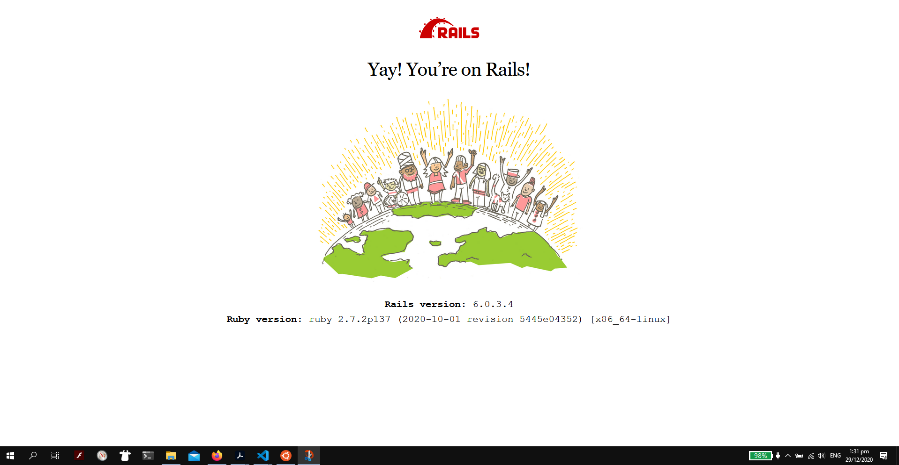

# CVWO-APP

Name: Lee En Hao

Matriculation Number: A0204679W

This repository contains the client application.

## Current state

The frontend application is done as a separate application. Due to the sake of deployment convenience, the repository is separated from the backend api repository.

External React library used:

- [Material-UI](https://material-ui.com/)

Other libraries used:

- React, Redux, Thunk

## CRUD Operations

The application supports basic functionality for adding, saving, updating and deleting tasks.

### Adding a task

To add a task, just type in the name of the task and its priority. Other attributes are optional. If dates are entered, they need to be of correct format (ISO 8601). Click the add task to add the task.

### Completing a task

Click the checkbox of the task on the list. The task will disappear from the list and appear in the list of completed task.

### Deleting a task

To delete a task, click on the task on the main list displayed. Click on the dustbin symbol at the top right of the dialog.

### Un-complete a task

Go to the list of completed tasks and uncheck the checkbox.

### Updating the task description

The task description can be updated by entering directly into the description box in the displayed task dialog.

## Screenshot

Obligatory screenshot of the default start up page.

